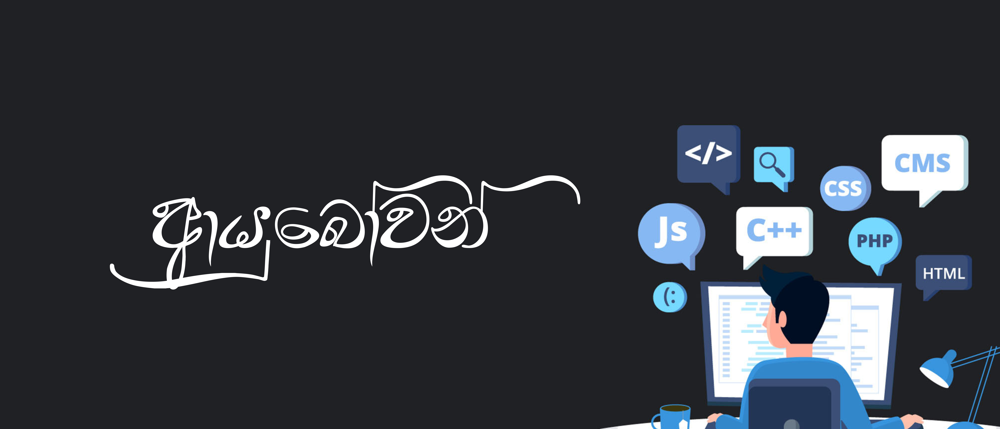

<h1 align="center"></h1>
<h3 align="center">I am a passionate Full Stack Developer and UI/UX Designer, with a knack for exploring the world of technology.</h3>

  

- 🌱 I’m currently learning **MEARN, Java and IoT**

- 👨‍💻 All of my projects are available at https://github.com/Avish-Madushanka
   Go check them!

- 📝 I regularly write articles on [https://medium.com/@avioniks](https://medium.com/@avioniks)

- 💬 Ask me about **UI/UX Designing and Full Stack Development**

- 📫 How to reach me **avishmadushanka21@gmail.com**

- 📄 Know about my experiences

### Blogs posts
<!-- BLOG-POST-LIST:START -->
<!-- BLOG-POST-LIST:END -->

<h3 align="left">Connect with Me:</h3>

<h3 align="left">Languages and Tools:</h3>

	<code></code>
	<code></code>
	<code></code>
	<code></code>
	<code></code>
	<code></code>
	<code></code>
	<code></code>
	<code></code>
	<code></code>
	<code></code>
	<code></code>
	<code></code>
	<code></code>
	<code></code>
	<code></code>
	<code></code>
	<code></code>
	<code></code>
	<code></code>
	<code></code>
	<code></code>
	<code></code>

 

  

   

 

